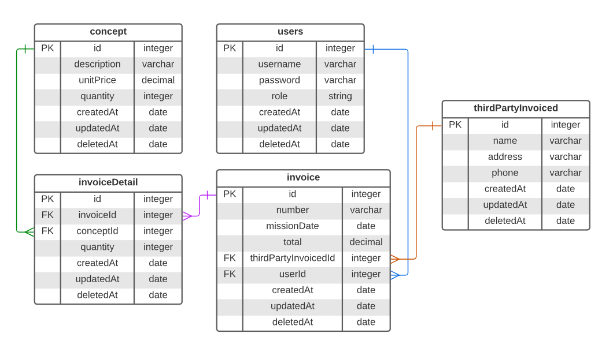

# CS3 TEST - API

La documentación está disponible en Español e Inglés, ambas contienen la misma información.

Documentación en Español: [Documentación](https://github.com/nicolasggdev/Prueba-Tecnica-CS3#versi%C3%B3n-en-espa%C3%B1ol)

The documentation is available in Spanish and English, both contain the same information.

Documentation in English: [Documentation](https://github.com/nicolasggdev/Prueba-Tecnica-CS3#english-version)

---

# English Version:

API with NestJS that manages an invoicing system. This API allows the creation, query, update and deletion of third party billed, invoices, concepts and invoice details.

<div>
    
</div>

## Doc

Documentation with Swagger:

To view the project documentation, you need to download it locally. You must install the dependencies and start the project; once the project is up, you can use your browser on the port you configured /docs. Example: If port 3000 was set in the environment variables, you will be able to view the documentation at http://localhost:3000/docs.

## Deploy

<b> https://prueba-tecnica-cs3.up.railway.app </b>

## Start the project

If you want to view the project locally, you must install the dependencies to properly view the API.

## Installation and start-up

### Requirements

It is necessary to have [Node.js versión 18.14.2](https://nodejs.org/)

### Installation `npm install`

This project uses a number of third-party open source tools, so it is necessary to install them. To do this, go to the project directory and run the `npm i` command. Wait for the installation to complete.

### Technology Stack

- [bcryptjs](https://github.com/dcodeIO/bcrypt.js#readme)
- [class-transformer](https://github.com/typestack/class-transformer#readme)
- [class-transformer](https://github.com/typestack/class-validator#readme)
- [helmet](https://github.com/helmetjs/helmet#readme)
- [morgan](https://github.com/expressjs/morgan#readme)
- [mysql2](https://github.com/sidorares/node-mysql2#mysql-2)
- [reflect-metadata](https://github.com/rbuckton/reflect-metadata#metadata-reflection-api)
- [rxjs](https://github.com/reactivex/rxjs#readme)
- [typeorm](https://github.com/typeorm/typeorm#readme)
- [winston](https://github.com/winstonjs/winston#readme)
- [winston-daily-rotate-file](https://github.com/winstonjs/winston-daily-rotate-file#readme)

### Configuration

It is necessary to create an .env file in the root of the project and configure the following variables in order to start the project. The values of these environment variables will be shared along with a guide attached to the mail.

| Variable         | Secret? | Requered? |  Type  | Description                     |
| ---------------- | :-----: | :-------: | :----: | ------------------------------- |
| `NODE_ENV`       |   No    |    Yes    | string | Execution environment.          |
| `PORT`           |   No    |    Yes    | number | Port of execution.              |
| `DB_DATABASE`    |   Yes   |    Yes    | string | Name of the database.           |
| `DB_HOST`        |   Yes   |    Yes    | string | Database host.                  |
| `DB_PORT`        |   Yes   |    Yes    | number | Database port.                  |
| `DB_USERNAME`    |   Yes   |    Yes    | string | Database user.                  |
| `DB_PASSWORD`    |   Yes   |    Yes    | string | Database password.              |
| `API_VERSION`    |   No    |    Yes    | string | API version.                    |
| `SALT`           |   No    |    Yes    | number | Value by which it is encrypted. |
| `JWT_SECRET`     |   No    |    Yes    | string | JWT secret password.            |
| `JWT_EXPIRES_IN` |   No    |    Yes    | string | JWT expiration time.            |

### Queries SQL

If this is the first time you start the application, it is important to execute the following queries:

1.  Create the database:
    <!-- language: lang-sql -->

    CREATE DATABASE project_cs3;

### Local initialization of the project

To start the application, run one of the following commands from the root of your project:

```shell
npm run start:dev
```

### Important remarks

1. The API does not have permanent deletion of records; instead, soft deletion was used.

2. The API has an initial Rate Limit of 100 requests per 1 minute by default, which could be changed in development, testing and/or production in the future.

3. Environment variables must be created in the root of the project under the name "config.env".

# Versión en Español:

API con NestJS que gestiona un sistema de facturación. Esta API permite la creación, consulta, actualización y eliminación de terceros facturados, facturas, conceptos y detalles de factura.

<div>
    
</div>

## Doc

Documentación con Swagger:

Para visualizar la documentación del proyecto, es necesario descargarlo localmente. Deberá instalar las dependencias e iniciarlizar el proyecto; una vez que el proyecto este levantado, puede usar su navegador en el puerto que configuró /docs. Ejemplo: Si se configuró en las variables de entorno el puerto 3000, podrás ver la documentación en http://localhost:3000/docs

## Deploy

<b> https://prueba-tecnica-cs3.up.railway.app </b>

## Inicia el proyecto

Si desea ver el proyecto localmente, debe instalar las dependencias para ver correctamente la API.

## Instalación e inicio

### Requerimientos

Es necesario contar con [Node.js versión 18.14.2](https://nodejs.org/)

### Instalación `npm install`

Este proyecto utiliza una serie de herramientas de código abierto de terceros, por lo que es necesario instalarlas. Para ello, diríjase al directorio del proyecto y ejecute el comando `npm i`. Espere a que se complete la instalación.

### Stack Tecnológico

- [bcryptjs](https://github.com/dcodeIO/bcrypt.js#readme)
- [class-transformer](https://github.com/typestack/class-transformer#readme)
- [class-transformer](https://github.com/typestack/class-validator#readme)
- [helmet](https://github.com/helmetjs/helmet#readme)
- [morgan](https://github.com/expressjs/morgan#readme)
- [mysql2](https://github.com/sidorares/node-mysql2#mysql-2)
- [reflect-metadata](https://github.com/rbuckton/reflect-metadata#metadata-reflection-api)
- [rxjs](https://github.com/reactivex/rxjs#readme)
- [typeorm](https://github.com/typeorm/typeorm#readme)
- [winston](https://github.com/winstonjs/winston#readme)
- [winston-daily-rotate-file](https://github.com/winstonjs/winston-daily-rotate-file#readme)

### Configuración

Es necesario crear un archivo .env en la raíz del proyecto y configurar las siguientes variables para poder iniciar el proyecto. Los valores de dichas variables de entorno se compartiran junto con una guia anexa al correo.

| Variable         | Secreta? | Requerida? |   Tipo   | Descripción                      |
| ---------------- | :------: | :--------: | :------: | -------------------------------- |
| `NODE_ENV`       |    No    |     Si     |  texto   | Entorno de ejecución.            |
| `PORT`           |    No    |     Si     | numerico | Puerto de ejecución.             |
| `DB_DATABASE`    |    Si    |     Si     |  texto   | Nombre de la base de datos.      |
| `DB_HOST`        |    Si    |     Si     |  texto   | Host de la base de datos.        |
| `DB_PORT`        |    Si    |     Si     | numerico | Puerto de la base de datos.      |
| `DB_USERNAME`    |    Si    |     Si     |  texto   | Usuario de la base de datos.     |
| `DB_PASSWORD`    |    Si    |     Si     |  texto   | Contrasenia de la base de datos. |
| `API_VERSION`    |    No    |     Si     |  texto   | Version de la API.               |
| `SALT`           |    No    |     Si     |  number  | Valor por el cual se encripta.   |
| `JWT_SECRET`     |    No    |     Si     |  texto   | Contrasenia secreta del JWT.     |
| `JWT_EXPIRES_IN` |    No    |     Si     |  texto   | Tiempo de expiración del JWT.    |

### Queries SQL

Si es la primera vez que inicia la aplicación, es importante ejecutar los siguientes queries:

1.  Crear la base de datos:
    <!-- language: lang-sql -->

    CREATE DATABASE project_cs3;

### Inicialización local del proyecto

Para iniciar la aplicación, ejecute uno de los siguientes comandos desde la raíz de su proyecto:

```shell
npm run start:dev
```

### Observaciones importantes

1. La API no cuenta con eliminado permanente de registros, sino que se utilizó el eliminado suave.

2. La API cuenta con un Rate Limit inicial de 100 peticiones por 1 minuto por defecto, lo cual podría ser cambiado en desarrollo, pruebas y/o producción en el futuro.

3. Las variables de entorno deben ser creadas en la raíz del proyecto bajo el nombre de "config.env"
